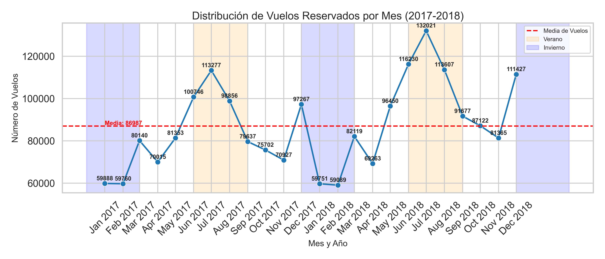
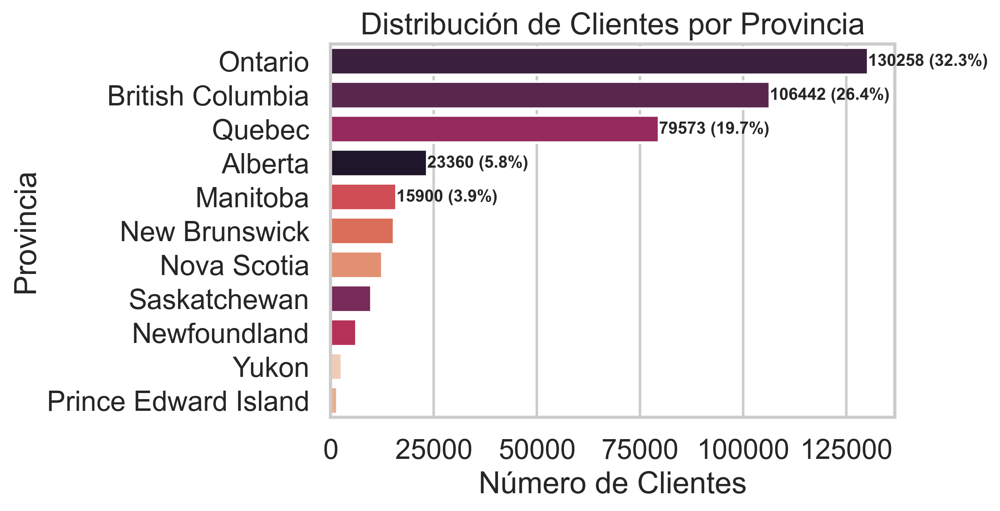
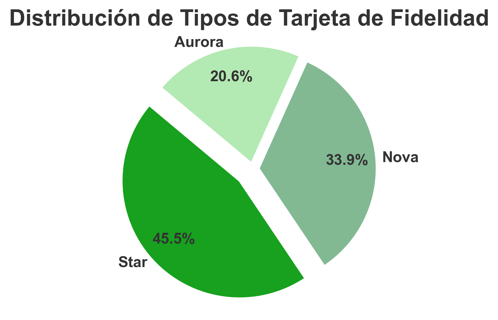

# ✈️ Airline Customer Loyalty Analysis  

Este proyecto corresponde a la **evaluación final del Módulo 3** del bootcamp de Data Analytics de ADALAB.  
El objetivo es analizar el comportamiento de los clientes dentro de un programa de lealtad de una aerolínea, respondiendo a preguntas clave mediante **exploración de datos, limpieza, visualización y estadística**.  

---
## 🧩 Estructura del Repositorio

```
📦 bda-modulo-3-evaluacion-final-juliabeco/
├── README.md                  # Documentación del proyecto
├── evaluacionM3.ipynb  # Notebook principal
└── resources/
    ├── Customer_Flight_Activity.csv
    ├── Customer_Loyalty_History.csv
    ├── flights_month_sns.PNG
    ├── loyalty_card_distribution.PNG
    └── province_distribution.PNG
```

---

## 📂 Datos Utilizados  

Se trabajó con dos archivos principales:  

- **Customer_Flight_Analysis.csv** → Información sobre actividad de vuelo (reservas, vuelos totales, distancia, puntos acumulados/redimidos, etc.).  
- **Customer_Loyalty_History.csv** → Perfil del cliente (género, educación, salario, estado civil, tarjeta de lealtad, CLV, entre otros).  

Ambos datasets se unieron a través de la columna **Loyalty Number**.  

---

## 🔎 Fases del Proyecto  

### 1. Exploración y Limpieza  
- Inspección inicial de la estructura de los datos.  
- Revisión y tratamiento de valores nulos.  
- Conversión de tipos de datos, revisión de inconsistencias, entre otros.  
- Unión de los dos datasets en un único DataFrame final.  

### 2. Visualización y Análisis  
Se respondieron las siguientes preguntas con **matplotlib y seaborn**:  

1. **¿Cómo se distribuye la cantidad de vuelos reservados por mes durante el año?**  
   → Serie temporal con áreas de vacaciones destacadas.  

2. **¿Existe una relación entre la distancia de los vuelos y los puntos acumulados?**  
   → Gráfico de dispersión para observar correlación acompañado de coeficiente de correlación.  

3. **¿Cuál es la distribución de los clientes por provincia o estado?**  
   → Gráfico de barras y visualización de las provincias/estados.  

4. **¿Cómo se compara el salario promedio entre diferentes niveles educativos?**  
   → Estadística descriptiva y boxplot para visualizar las diferentes distribuciones.  

5. **¿Cuál es la proporción de clientes según tipo de tarjeta de fidelidad?**  
   → Pie chart estilizado.  

6. **¿Cómo se distribuyen los clientes según estado civil y género?**  
   → Gráficos de barras agrupadas en valores absolutos y en porcentaje.  

### 3. Evaluación Estadística  
- Se evaluó si existen diferencias significativas en el número de vuelos reservados según el nivel educativo.  
  

---

## 🛠️ Tecnologías Utilizadas  


[](https://www.python.org/)  
[](https://pandas.pydata.org/)  
[](https://matplotlib.org/)  
[](https://seaborn.pydata.org/)  
[](https://scipy.org/)  
[](https://scikit-learn.org/stable/)  
[](https://jupyter.org/)  
  

---

## 🚀 Cómo usar el proyecto  

1. Clonar este repositorio.  
2. Instalar dependencias necesarias (pandas, matplotlib, seaborn, scipy).  
3. Abrir y ejecutar el notebook:  
   ```bash
   jupyter notebook evaluacionM3.ipynb
---


## Algunas visualizaciones

- Distribución de vuelos reservados por mes años 2017-2018
  


- Distribución de clientes según provincia de origen



- Distribución de clientes según tipo de tarjeta de fidelidad



---

## 💡 Ideas para profundizar el proyecto

- 📊 Incorporar **visualizaciones interactivas** con Plotly o Bokeh.  
- 🛠️ Crear **funciones modulares** y convertirlas en librería propia.  
- ⚙️ Automatizar procesos mediante **scripts ETL en .py**.  
- 🧪 Añadir análisis de **machine learning predictivo** (ej. churn de clientes).  

## 📌 Notas Finales  

Este trabajo constituye la **entrega de evaluación final del Módulo 3** del Bootcamp de Data Analytics en ADALAB.  
El proyecto está **completo y funcional**, pero se planea seguir profundizando en:  

- Nuevos análisis estadísticos.  
- Visualizaciones interactivas.  
- Optimización del código para producción.  

✅ La idea es que este notebook sirva como base para un análisis más robusto y aplicable en entornos reales de negocio.  
